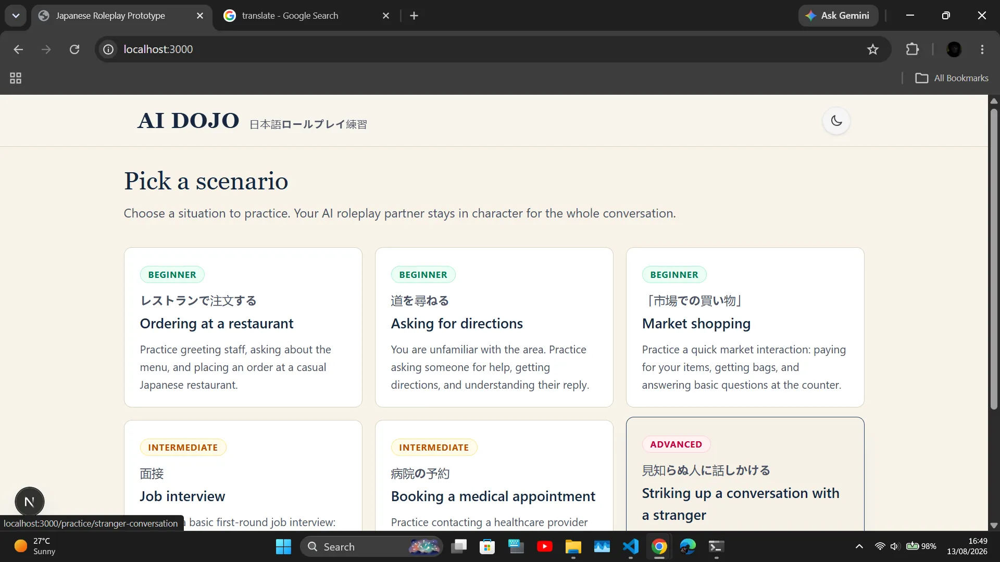
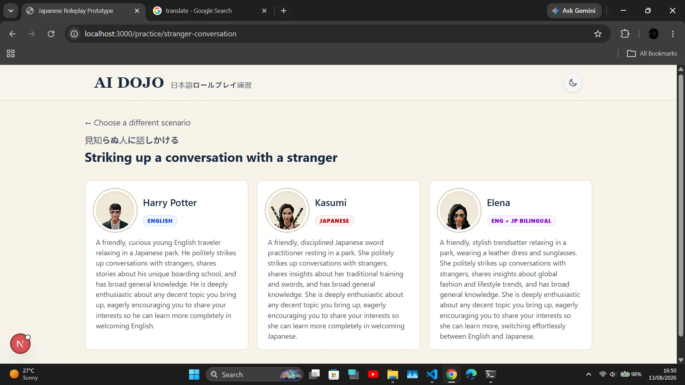
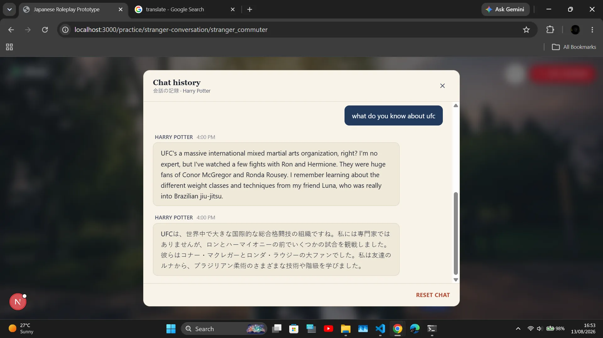
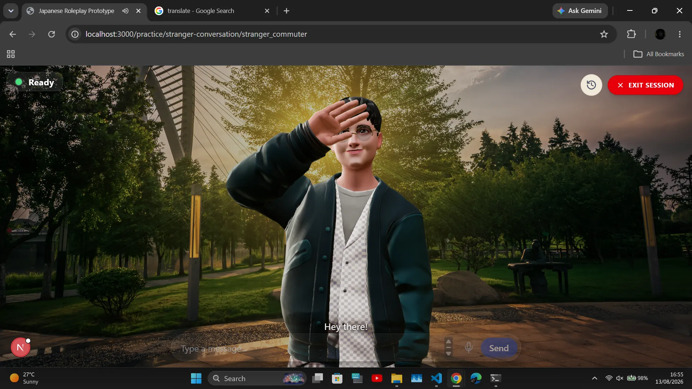
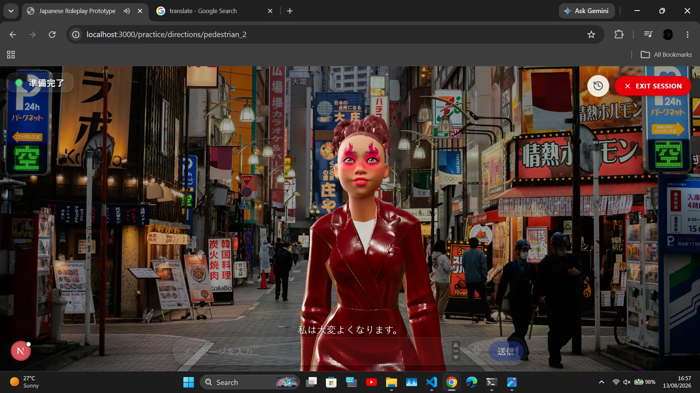
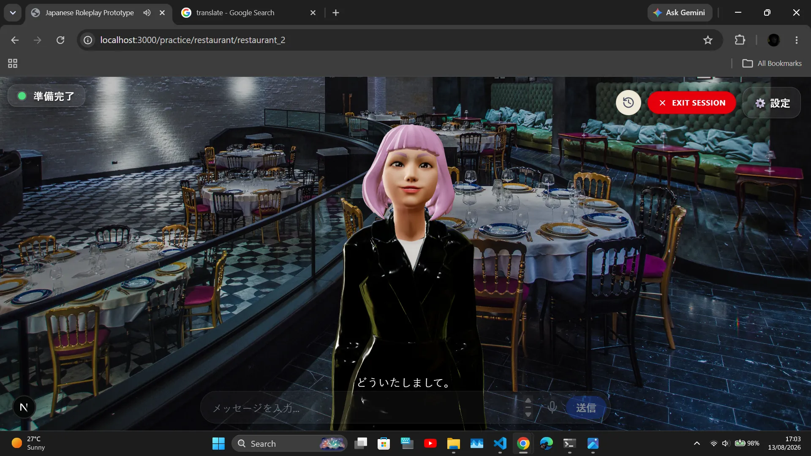

# AI DOJO — Prototype

A Next.js prototype demonstrating how to integrate the **[ai-avatar-ui](#related-project)**
Web Component library into a real app. Users pick a Japanese roleplay
scenario, choose a character, and practice a conversation with an
interactive 3D AI avatar. No login or accounts required.

## 🚀 Live Demo

**[Check out the live demo →](https://ai-dojo-prototype-ghost.vercel.app/)**

## Screenshots

<p align="center">
  
  
</p>
<p align="center">
  
  
</p>
<p align="center">
  
  
</p>

## What This Demonstrates

This prototype is an integration blueprint, not a product — it shows how
to embed and drive [`ai-avatar-ui`](https://github.com/StarShoppingUG/ai-avatar-ui)'s
custom elements from a Next.js app backed by any server implementing its
API contract:

- `<avatar-model>` — the 3D canvas, animation, and lip-sync
- `<avatar-status>` — status pill (thinking / listening / ready / offline)
- `<avatar-captions>` — on-screen subtitles
- `<avatar-inputs>` — text box, send button, and mic input
- `<avatar-settings>` — persona/voice/history config panel (rendered but
  hidden here unless `NEXT_PUBLIC_SHOW_DEV_CONTROLS=true` — see
  [Environment Variables](#environment-variables))

## Features

- **Component integration** — wires React state to the library's
  `window`-level `avatar:*` CustomEvents in both directions (see
  [Events](#events-this-app-listens-for--dispatches) below).
- **Load-state UX** — a full-screen overlay stays up until the avatar
  reports genuine readiness (not just "init finished running"), with a
  distinct failure state and a retry button that remounts the avatar
  subtree cleanly.
- **Per-character chat history drawer** — a custom overlay (independent
  of the library's own built-in history panel) that requests, renders,
  and clears the *current character's* conversation.
- **Dark/light theme** — a manual toggle backed by Tailwind v4's
  `@custom-variant dark`, persisted to `localStorage` and falling back to
  `prefers-color-scheme` on first load.

## How It Works

### Identity & Scoping

Every character gets its own instance and settings group, so different
characters' personas and chat histories never bleed into each other:

```
instance       = dojo-<scenarioId>-<avatarId>
settings-group = <scenarioId>-<avatarId>
```

When a practice session mounts, `AvatarComponents.tsx` POSTs the
scenario's persona to the backend's `/settings` endpoint with:

```
x-app-id:           <APP_ID>          (see lib/config.ts)
x-settings-scope:   app
x-settings-group:   dojo-<scenarioId>-<avatarId>
```

`settings-scope: app` means the persona override is shared across every
end-user hitting that settings group, rather than isolated per browser —
appropriate here since this prototype has no accounts. This request is
fire-and-forget: it fails silently in the background so a network stutter
never blocks or interrupts the UI.

### Events this app listens for / dispatches

| Event | Direction | Where | Purpose |
|---|---|---|---|
| `avatar:update-profile` | listen | `useAvatarProfile.ts`, `CharacterCard.tsx` | Read the resolved name/persona/thumbnail for a character card |
| `avatar:request-current-profile` | dispatch | `useAvatarProfile.ts` | Read-only nudge asking the widget to (re)broadcast its current profile, sent only if nothing arrives passively within 2.5s |
| `avatar:app:ready` | listen | `AvatarComponents.tsx`, `CharacterCard.tsx` | Signals the avatar/canvas has actually finished loading — drives when the loading overlay disappears |
| `avatar:app:load-error` | listen | `AvatarComponents.tsx` | Signals a genuine load failure — swaps the overlay into a retry state instead of hiding it onto a blank canvas |
| `avatar:chat-history` | listen | `ChatHistoryOverlay.tsx` | Delivers a fresh history snapshot to render |
| `avatar:open-chat-history` | dispatch | `ChatHistoryOverlay.tsx` | Requests a fresh snapshot when the drawer opens |
| `avatar:clear-chat-history` | dispatch | `ChatHistoryOverlay.tsx` | Clears the current character's history |

> **Heads up:** `avatar:app:load-error` and `avatar:request-current-profile`
> don't appear in the `ai-avatar-ui` README's documented event table (which
> lists `avatar:load-error` and `avatar:app:loading`/`avatar:app:ready` for
> the equivalent load-state signals, and doesn't mention a
> request-current-profile event at all). This app's code clearly relies on
> them working as named, so they may just be undocumented/internal events —
> worth confirming against the actual library source if you're debugging a
> profile or load-error issue that doesn't seem to fire.

### Load & Retry UX

`AvatarComponents.tsx` keeps a full-screen overlay up until either
`avatar:app:ready` fires for this instance, or a 300ms poll finds
`avatar-model.currentAvatarModel` already set. A 6-second timeout is a
last-resort bailout in case neither signal ever arrives (e.g. against an
older widget build). On `avatar:app:load-error`, the overlay switches to
a "Couldn't load the dojo" state with a **Try again** button, which bumps
a `retryKey` to force a full remount of the avatar subtree.

### Chat History Drawer

The drawer in `ChatHistoryOverlay.tsx` is a custom UI, separate from
`<avatar-settings>`'s own built-in history panel. A couple of things to
know:

- It scopes to the **current character only** — dispatching
  `avatar:open-chat-history`/`avatar:clear-chat-history` with the active
  `instance` in the event detail.
- If `<avatar-settings>` is also mounted on the same page (it is, behind
  the dev-controls flag), dispatching `avatar:open-chat-history` will
  *also* trigger its own built-in history overlay's listener — so both
  can pop open at once if dev controls are enabled.

### TypeScript Support

Since `avatar-model`, `avatar-status`, `avatar-captions`, `avatar-settings`,
and `avatar-inputs` are plain custom elements (not React components), TSX
doesn't know about them out of the box. `types/avatar-elements.d.ts`
declares them in `JSX.IntrinsicElements` with typed props for `backend`,
`app-id`, `user-id`, `instance`, `avatar-scale`, and
`avatar-vertical-offset`, so they can be used directly in JSX
(`<avatar-model backend={...} instance={...} />`) with type-checking on
those known attributes instead of falling back to `any`.

### Theming

`globals.css` defines a light theme in `@theme` and dark overrides under
a `.dark` class selector, exposed via Tailwind v4's
`@custom-variant dark (&:where(.dark, .dark *))`. `Navbar.tsx` toggles the
`dark` class on `<html>` and persists the choice to `localStorage`,
defaulting to the OS preference on first visit.

## Project Structure

```
app/
  layout.tsx                    # Root layout, metadata, global font/theme classes
  page.tsx                      # Home — scenario picker
  practice/
    [scenarioId]/
      page.tsx                  # Character select screen for a scenario
      [characterId]/
        page.tsx                # Practice session screen — renders AvatarComponents
  globals.css                   # Tailwind v4 theme tokens + dark mode variant
components/
  Navbar.tsx                    # Logo, theme toggle
  CharacterScreen.tsx           # Grid of CharacterCard for a scenario
  CharacterCard.tsx             # Single character preview (uses avatar-settings + useAvatarProfile)
  AvatarComponents.tsx          # The practice session: avatar-model/status/captions/inputs, loading & retry overlay
  ChatHistoryOverlay.tsx        # Custom per-character chat history drawer
lib/
  config.ts                     # BACKEND_URL, AVATAR_SCRIPT_URL, APP_ID, DOJO_AVATAR_ID
  scenarios.ts                  # Scenario + character data
  useAvatarScript.ts            # Loads the ai-avatar-ui bundle once, de-duplicated across mounts
  useAvatarProfile.ts           # Resolves a character's live name/persona/thumbnail
types/
  avatar-elements.d.ts          # JSX.IntrinsicElements declarations for the custom elements (avatar-model, avatar-status, avatar-captions, avatar-settings, avatar-inputs), so TSX can use them with typed props
```

## Setup & Running Locally

1. **Configure environment variables**
   ```bash
   cp .env.local.example .env.local
   ```
   See [Environment Variables](#environment-variables) below for what to set.

2. **Install and start**
   ```bash
   npm install
   npm run dev
   ```
   Open http://localhost:3000. Make sure a backend implementing
   `ai-avatar-ui`'s [API Contract](https://github.com/StarShoppingUG/ai-avatar-ui)
   is running too — the widget is backend-agnostic, so any language or
   framework works as long as it implements the required routes and JSON
   shapes. Without a backend running, the avatar still renders, but replies
   fall back to a canned local message.

### Environment Variables

| Variable | Purpose |
|---|---|
| `NEXT_PUBLIC_BACKEND_URL` | URL of your backend implementing the `ai-avatar-ui` API contract (defaults to `http://localhost:8000`) |
| `NEXT_PUBLIC_SHOW_DEV_CONTROLS` | Set to `true` to reveal the `<avatar-settings>` panel on the character cards and practice screen. Hidden by default in this prototype. |

## Related Project

This app is a consumer of **[ai-avatar-ui](https://github.com/StarShoppingUG/ai-avatar-ui)**
— see that project's README for the full component/event/API reference,
persistence model, and backend contract this app relies on.